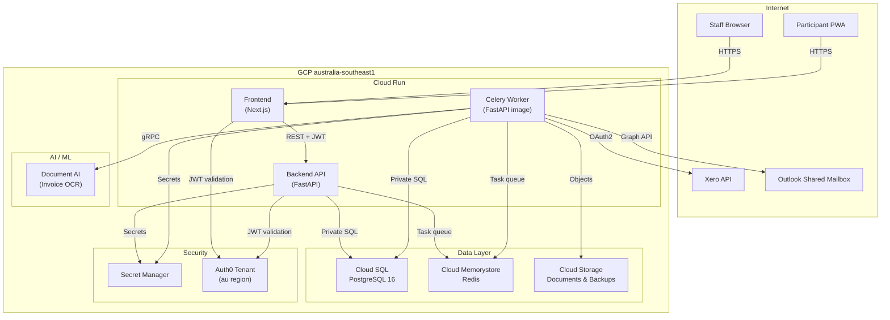
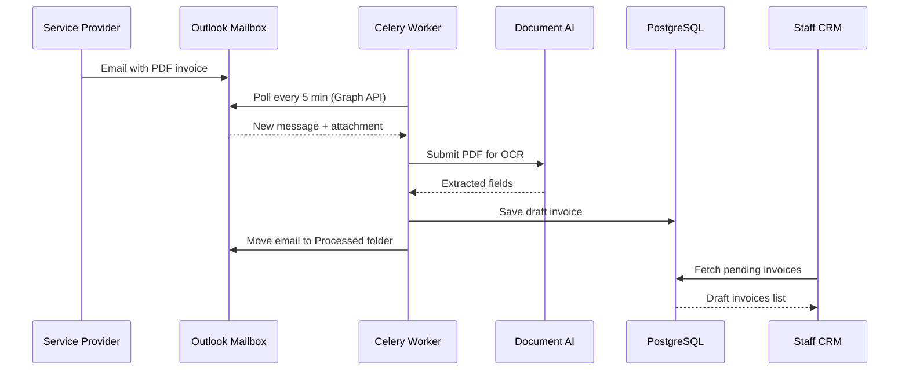
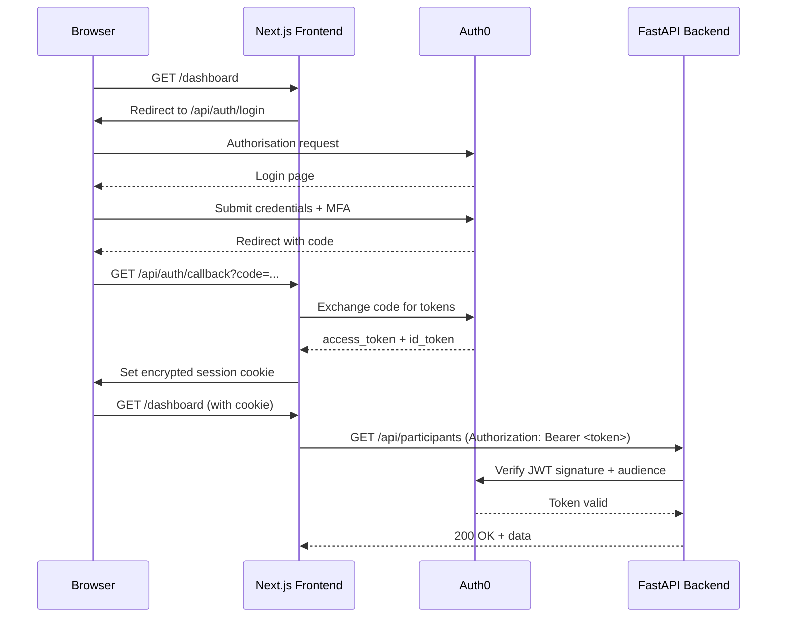

# NDIS CRM — Technical Architecture

## Contents

1. [System Overview](#1-system-overview)
2. [Technology Stack](#2-technology-stack)
3. [Component Diagram](#3-component-diagram)
4. [Data Flow Diagrams](#4-data-flow-diagrams)
5. [Infrastructure Overview](#5-infrastructure-overview)
6. [Security Architecture](#6-security-architecture)

---

## 1. System Overview

The NDIS CRM is a cloud-native web application built on Google Cloud Platform
(GCP) in the `australia-southeast1` (Sydney) region. It consists of a FastAPI
backend API, a Next.js frontend (staff dashboard + participant portal), and a
set of Celery background workers that handle asynchronous processing.

All data is stored in Australian infrastructure to satisfy Australian data
sovereignty requirements under the Privacy Act 1988.

---

## 2. Technology Stack

| Layer | Technology | Version |
|-------|-----------|---------|
| **Backend API** | Python / FastAPI | 3.12 / 0.111+ |
| **ORM / Migrations** | SQLAlchemy (async) + Alembic | 2.x / 1.x |
| **Background tasks** | Celery + Redis | 5.x |
| **Frontend** | Next.js (App Router) | 14 |
| **Authentication** | Auth0 (JWT) | — |
| **Database** | PostgreSQL | 16 |
| **Object storage** | Google Cloud Storage | — |
| **Invoice OCR** | Google Document AI | — |
| **Accounting** | Xero API | OAuth 2.0 |
| **Email** | Microsoft Graph API (Outlook) | v1.0 |
| **Push notifications** | Web Push (VAPID) | — |
| **Container runtime** | Cloud Run (managed) | — |
| **Infrastructure as Code** | Terraform | ≥ 1.5 |
| **CI/CD** | GitHub Actions | — |

---

## 3. Component Diagram



---

## 4. Data Flow Diagrams

### 4.1 Invoice ingestion flow



### 4.2 Invoice approval and Xero sync flow

```mermaid
sequenceDiagram
    participant Staff as Staff CRM
    participant BE as Backend API
    participant DB as PostgreSQL
    participant Worker as Celery Worker
    participant Xero as Xero API
    participant Participant as Participant Portal

    Staff->>BE: POST /invoices/{id}/approve
    BE->>DB: Update status = approved
    BE->>Worker: Queue xero_sync task
    Worker->>Xero: Create/update invoice
    Xero-->>Worker: Invoice ID
    Worker->>DB: Save Xero invoice ID + status = synced
    BE->>Worker: Queue participant_notification task
    Worker->>Participant: Send push notification
```

### 4.3 Authentication flow



---

## 5. Infrastructure Overview

All GCP resources are provisioned with Terraform (see `infra/terraform/`).

### 5.1 Network topology

```
VPC: ndis-crm-vpc
├── Subnet: 10.0.0.0/24 (australia-southeast1)
│   └── Cloud SQL private IP
├── VPC Serverless Connector: 10.8.0.0/28
│   └── Enables Cloud Run → Cloud SQL private connectivity
└── Private Service Connection
    └── google-managed-services-peering
```

All Cloud Run services use the VPC connector to reach Cloud SQL and Redis via
private IP. Neither Cloud SQL nor Redis has a public IP.

### 5.2 GCP services used

| Service | Purpose |
|---------|---------|
| Cloud Run (managed) | Backend API, frontend, Celery workers |
| Cloud SQL (PostgreSQL 16) | Primary relational database |
| Cloud Memorystore (Redis) | Celery broker and result backend |
| Cloud Storage | Document and backup storage |
| Artifact Registry | Container image registry |
| Secret Manager | Credentials and secrets |
| Document AI | Invoice OCR |
| Cloud Build | (optional) CI image builds |
| VPC | Private networking |

### 5.3 Scaling

- **Backend Cloud Run**: min 1 instance, max 10. CPU always allocated.
- **Frontend Cloud Run**: min 1 instance, max 5.
- **Cloud SQL**: `db-g1-small` with regional HA (automatic failover replica).
- **Redis**: 1 GB standard tier.

---

## 6. Security Architecture

### 6.1 Authentication and authorisation

- All users authenticate via **Auth0** using the Authorization Code + PKCE flow.
- The backend validates **RS256 JWTs** on every request.
- Role-based access: `staff`, `admin`, and `participant` roles are assigned in
  Auth0 and embedded in the JWT claims.
- MFA is enforced for all `staff` and `admin` users via an Auth0 Action.

### 6.2 Secrets management

- All credentials are stored in **GCP Secret Manager**.
- Cloud Run services access secrets via the Secret Manager API using IAM
  Workload Identity — no key files are baked into container images.
- Secrets are never committed to version control.

### 6.3 Network security

- Cloud SQL and Redis have **private IP only** — no public endpoint.
- Cloud Run egress is restricted to private ranges via the VPC connector.
- GCS buckets block all public access; objects are served via signed URLs only.

### 6.4 Data protection

- Database: TLS in transit, AES-256 encryption at rest (Google-managed keys).
- GCS: server-side encryption (Google-managed keys), object versioning enabled.
- Audit logging: all data changes are recorded in the `audit_logs` table with
  user ID, timestamp, and before/after values.

### 6.5 CI/CD security

- GitHub Actions authenticates to GCP using **Workload Identity Federation** —
  no long-lived service account keys are stored as GitHub secrets.
- Container images are scanned for vulnerabilities in the build pipeline.
