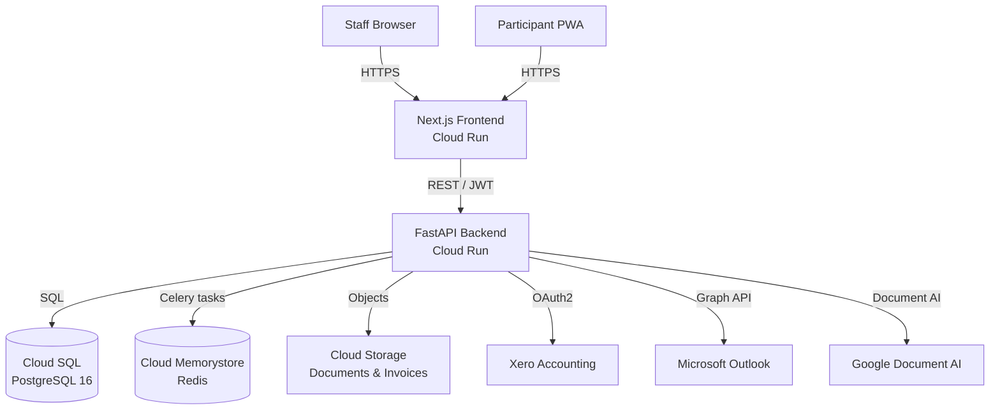

# NDIS CRM — Staff Training Guide

## Contents

1. [System Overview](#1-system-overview)
2. [Getting Started](#2-getting-started)
3. [Managing Participants](#3-managing-participants)
4. [Invoice Management](#4-invoice-management)
5. [Budget Monitoring](#5-budget-monitoring)
6. [Reports](#6-reports)
7. [FAQ & Troubleshooting](#7-faq--troubleshooting)

---

## 1. System Overview

The NDIS CRM is a purpose-built platform for managing NDIS participants, their
plans, and associated invoicing. It integrates with:

- **Xero** — for accounting and invoice synchronisation
- **Microsoft Outlook** — for automated email notifications
- **Google Document AI** — for OCR-based invoice ingestion from the shared mailbox

### Architecture diagram

---

## 2. Getting Started

### 2.1 Login

1. Navigate to `https://ndis-crm.your-org.com.au`.
2. Click **Log in**.
3. You will be redirected to the Auth0 login page.
4. Enter your organisation email address and password.
5. If multi-factor authentication (MFA) is enabled, complete the MFA challenge.
6. You will be redirected back to the CRM dashboard.

### 2.2 Navigation

The left-hand sidebar contains the main navigation links:

| Icon | Section | Purpose |
|------|---------|---------|
| 🏠 | Dashboard | Summary of pending invoices, budget alerts, and recent activity |
| 👥 | Participants | Full list of NDIS participants and their plans |
| 🧾 | Invoices | Invoice review queue and history |
| 📊 | Reports | Analytics and exportable reports |
| ⚙️ | Settings | Personal profile and notification preferences |

---

## 3. Managing Participants

### 3.1 Viewing the participant list

1. Click **Participants** in the sidebar.
2. Use the search bar to filter by name, NDIS number, or plan manager.
3. Click any row to open the participant detail page.

### 3.2 Creating a participant

1. Click **Participants → New Participant**.
2. Fill in the required fields:
   - **Legal name** and **preferred name**
   - **NDIS number** (format: `XXXXXXXXX`)
   - **Date of birth**
   - **Contact details** (email, phone)
3. Click **Save**.

### 3.3 Adding or editing a plan

1. Open the participant detail page.
2. Click the **Plans** tab.
3. Click **Add Plan** or click an existing plan to edit it.
4. Enter the plan period, total budget, and support category budgets.
5. Click **Save Plan**.

### 3.4 Viewing participant portal access

Each participant with an email address receives an invitation to the
self-service participant portal. Their portal access status is shown on the
participant detail page under **Portal Access**.

---

## 4. Invoice Management

### 4.1 How invoices arrive

Invoices from service providers are emailed to the shared Outlook mailbox
(`invoices@your-org.com.au`). A background Celery task polls the mailbox every
5 minutes, downloads PDF attachments, and submits them to Google Document AI
for OCR processing. Extracted data is stored as draft invoices in the CRM.

### 4.2 Invoice review queue

1. Click **Invoices** in the sidebar.
2. The **Pending Review** tab lists all invoices awaiting staff action.
3. Click an invoice to open the review panel.

### 4.3 Reviewing an invoice

The review panel shows:
- **Extracted fields**: provider name, ABN, invoice number, date, line items,
  GST, and total.
- **PDF preview**: the original PDF alongside the extracted data.
- **Validation results**: any warnings or errors detected automatically
  (e.g. budget exceeded, duplicate invoice, ABN mismatch).

### 4.4 Approve or reject

- **Approve**: Marks the invoice as approved and queues it for Xero sync.
  If participant approval is required, the participant receives a notification
  in their portal.
- **Request changes**: Sends a message back to the service provider requesting
  a corrected invoice.
- **Reject**: Marks the invoice as rejected. Add a rejection reason for audit.

### 4.5 Xero synchronisation

Approved invoices are automatically pushed to Xero within a few minutes via a
background task. The **Xero Status** column shows `Synced`, `Pending`, or
`Failed`. Failed syncs can be retried from the invoice detail page.

---

## 5. Budget Monitoring

### 5.1 Budget overview

Each participant plan shows a budget overview broken down by NDIS support
category (Core, Capacity Building, Capital). The progress bars indicate
remaining budget.

### 5.2 Budget alerts

The system sends alerts when a participant's budget in any category reaches:
- **80%** — Yellow warning
- **100%** — Red alert

Alerts appear on the dashboard and are also sent to the participant's portal
and (if configured) via Outlook email.

---

## 6. Reports

### 6.1 Available reports

| Report | Description |
|--------|-------------|
| Invoice Summary | All invoices within a date range, filterable by status |
| Budget Utilisation | Spend per support category across all participants |
| Participant Activity | Login and invoice approval activity per participant |
| Monthly Statement | PDF statement of invoices for a participant (one month) |

### 6.2 Running a report

1. Click **Reports** in the sidebar.
2. Select the report type.
3. Set the filters (date range, participant, etc.).
4. Click **Generate**.

### 6.3 Exporting

Click **Export CSV** or **Download PDF** to save the report.

---

## 7. FAQ & Troubleshooting

**Q: An invoice arrived but I can't see it in the review queue.**
A: OCR processing can take up to 10 minutes. Refresh the page. If the invoice
is still missing after 15 minutes, check the shared Outlook mailbox to confirm
the email was received, then contact your system administrator.

**Q: I approved an invoice but the Xero status shows "Failed".**
A: Click the invoice, then click **Retry Xero Sync**. If it fails again, check
with your system administrator that the Xero connection is active.

**Q: I can't log in.**
A: Ensure you are using your organisation email address. If you have forgotten
your password, click **Forgot password** on the Auth0 login page. Contact your
system administrator if the problem persists.

**Q: A participant says they haven't received their portal invitation.**
A: Open the participant detail page and click **Resend Portal Invitation** under
**Portal Access**.

**Q: Where do I find the audit log?**
A: Navigate to **Settings → Audit Log**. All approvals, rejections, and data
changes are logged with a timestamp and the staff member who made the change.
